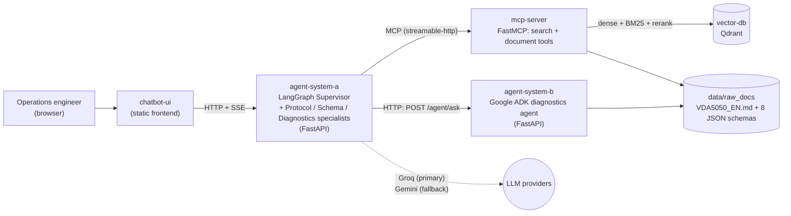

# VDA 5050 Fleet Operations System

A multi-agent AI system that answers questions about, and validates
messages against, the **VDA 5050** standard — the open interface spec
used for communication between fleets of AGVs/AMRs (mobile robots) and a
central fleet control system in warehouses and factories.

**Who it's for:** an operations or integration engineer working with a
VDA 5050-based fleet who needs a fast, grounded answer to "what does the
spec say about X" or "is this JSON payload valid," without manually
searching a 2,175-line specification document and 8 separate JSON
schemas by hand. It answers from the real spec text — cited to source,
not guessed at — and for validation-shaped questions, checks
deterministically against the actual schema rather than asking a
language model to eyeball it.

Full background and how this maps to the assignment rubric:
[`docs/PROPOSAL.md`](docs/PROPOSAL.md). Deep technical walkthrough of
every file and decision: [`docs/PROJECT_GUIDE.md`](docs/PROJECT_GUIDE.md).

---

## Architecture

Five containers, one `docker-compose up`:



| Container | What it runs | Why a separate container |
|---|---|---|
| `agent-system-a` | LangGraph Supervisor + Protocol/Schema/Diagnostics specialists, FastAPI, SSE streaming | Assignment requirement — primary system, holds the routing/business logic |
| `agent-system-b` | Google ADK agent wrapping two deterministic tools (schema validation, error-type lookup) | Assignment requirement — independent framework, reachable only over a real network call, not a Python import |
| `mcp-server` | FastMCP server exposing the RAG search + document-management tools | So the same tools are callable by Agent A, by the evaluation harness, or by any future consumer, without duplicating the implementation |
| `vector-db` | Qdrant, standalone | Assignment-recommended vector database |
| `chatbot-ui` | Static HTML/CSS/JS frontend | Simplest thing that lets a human actually use the system without a build step |

Every hop between `agent-system-a` and `agent-system-b` is a real HTTP
call across the Docker network — not a function call — which is what the
assignment is actually testing with the "two independent agent systems"
requirement. Full request-by-request trace of two real conversations:
[`docs/PROJECT_GUIDE.md`](docs/PROJECT_GUIDE.md) Part 8.

---

## Quickstart (from a clean clone)

```bash
git clone <this-repo>
cd vda5050-fleet-operations-system
cp .env.example .env      # fill in GROQ_API_KEY and GOOGLE_API_KEY (both free-tier)
docker compose up --build
```

First run only — the `vector-db` container starts empty, so embed the
spec into it:

```bash
docker compose exec mcp-server python -m core.run_ingestion
```

Then open **`http://localhost:8080`**.

That's the whole setup. No other manual steps, no seed data to copy in
by hand — `data/raw_docs/` (the spec + schemas) is committed to the repo
and gets mounted into `mcp-server` automatically by `docker-compose.yml`.

This is the Docker Compose deployment method. A second, manual method
(no Compose — raw `docker network`/`docker build`/`docker run` commands)
also exists, for the assignment's two-methods requirement:
[`docs/DOCKER_MANUAL_METHOD.md`](docs/DOCKER_MANUAL_METHOD.md) (commands
+ how to test it) and
[`docs/DOCKER_EXPLAINED.md`](docs/DOCKER_EXPLAINED.md) (the concepts
behind it — images vs. containers, why the network has to be created
explicitly, volumes, etc.).

### Verifying it's actually working

```bash
curl http://localhost:8000/health          # agent-system-a
curl http://localhost:8002/health          # agent-system-b (if exposed; else check container logs)
docker compose logs mcp-server | tail -20  # should show "Hybrid Retriever ready" after ingestion
```

Then ask the UI something like *"What does NODE_UNREACHABLE mean?"* — a
grounded answer citing the spec's error-type table means the whole chain
(UI → Agent A → MCP → Qdrant → LLM) is working end to end.

### Running the evaluation suite

Not needed to use the system, but if you want to reproduce the numbers
in [`docs/EVALUATION.md`](docs/EVALUATION.md) yourself:
see [`evaluation/README.md`](evaluation/README.md) — CLI only, doesn't
need the full `docker compose up`, and the retrieval-only parts make
zero LLM calls.

---

## Streaming (SSE)

`agent-system-a` exposes two message endpoints per conversation:

- `POST /conversations/{id}/messages` — waits for the full reply, returns `{"reply": "..."}`.
- `POST /conversations/{id}/messages/stream` — Server-Sent Events. Streams
  one `data: {...}` frame per graph step as it actually finishes (routing,
  searching, finalizing), then a closing `data: {"done": true, "reply": "..."}`
  frame. This is **step-level** streaming, not token-level — see "Technical
  decisions" below for why. The chatbot UI uses this endpoint by default.

  Try it directly:
  ```bash
  curl -N -X POST http://localhost:8000/conversations/<id>/messages/stream \
    -H "Content-Type: application/json" \
    -d '{"message": "What does NODE_UNREACHABLE mean?"}'
  ```

---

## Technical decisions and justifications

The full reference table (every real decision, alternatives considered,
why chosen, and the actual cost paid) is
[`docs/PROJECT_GUIDE.md`](docs/PROJECT_GUIDE.md) Part 9. The five most
likely to come up in a defense:

- **Structure-aware chunking (Markdown headers + JSON-schema
  parent-child splitting) instead of one generic character-count
  splitter.** Measured, not assumed: it beats every naive fixed-size
  configuration tested on Precision@3, using 40-60% fewer chunks. Full
  seven-configuration comparison: [`docs/EVALUATION.md`](docs/EVALUATION.md) §2.
- **`BAAI/bge-m3` as the embedding model** — chosen specifically because
  it's multilingual, which matters here: the system has already had (and
  fixed) a real cross-language bug, and the agent evaluation suite
  includes a French-language test case that round-trips correctly
  through the real graph.
- **Hybrid (BM25 + dense) retrieval + cross-encoder reranking as the
  intended retrieval design** — measurably the best-performing
  configuration in `docs/EVALUATION.md` §2, and the reason it's phrased
  as "intended" rather than just "the design": a later correctness fix
  (making per-conversation document uploads discoverable) accidentally
  means this pipeline isn't what's actually served in production today.
  That trade-off — costs and all — is documented, not hidden: see "Known
  limitations" below and `docs/PROJECT_GUIDE.md` Part 3.5.
- **Two independent agent systems on different frameworks (LangGraph +
  Google ADK), talking over a real HTTP call** — the assignment's core
  architecture requirement. Agent System B's job (deterministic
  validation/lookup) is also architecturally distinct enough from Agent
  System A's job (open-ended retrieval/conversation) that the split has
  real merit beyond just satisfying the requirement: A degrades
  gracefully instead of crashing if B is down.
- **Step-level SSE streaming, not token-level** — the ReAct tool-calling
  loop needs each LLM call's complete response before it can check
  whether a tool should be called; restructuring the whole loop to
  support token streaming was judged too risky this close to the
  deadline for a requirement step-level streaming already satisfies.

---

## Testing

Full manual test pass (every endpoint, every guardrail case, multilingual,
upload/delete/isolation, the evaluation suite, both Docker methods):
[`TEST_CHECKLIST.md`](TEST_CHECKLIST.md). Five-minute live demo script:
[`DEMO.md`](DEMO.md).

## Evaluation

Full report: [`docs/EVALUATION.md`](docs/EVALUATION.md) — test set,
retrieval metrics across 7 configurations, generation eval (LLM-judge),
agent routing accuracy (confusion matrix + per-tool breakdown), two
required configuration comparisons with numbers, and 3 documented
failure cases with root-cause analysis. Raw, timestamped run data behind
every number: [`evaluation/*/results/`](evaluation/).

---

## Known limitations

Stated plainly, on purpose — the assignment explicitly rewards this over
hiding gaps. Full list with more detail:
[`docs/PROJECT_GUIDE.md`](docs/PROJECT_GUIDE.md) Part 10.

1. **The hybrid+reranked retrieval pipeline — the better-performing
   configuration per `docs/EVALUATION.md` §2 — isn't what's actually
   served in production.** A correctness fix (making per-conversation
   uploads discoverable) requires passing `conversation_id` on every
   search, which routes to a simpler dense-only path. Measured cost:
   Precision@3 drops from 0.648 to 0.574. See
   [`docs/PROJECT_GUIDE.md`](docs/PROJECT_GUIDE.md) Part 3.5 for the
   full trade-off and the scoped fix that was deliberately deferred past
   this deadline.
2. **Deleting a document doesn't erase a conversation's memory of it.**
   Deletion itself (removing chunks from Qdrant) works correctly — but a
   conversation that already discussed that content keeps its own
   answer in its checkpointed history. Only *new* searches are affected.
3. **14 of 22 spec diagrams have zero text representation in the RAG
   corpus.** No image/vision pipeline exists.
4. **True token-by-token streaming isn't implemented** — see "Technical
   decisions" above.
5. **The small router model occasionally misroutes** grammatically
   unusual or genuinely dual-intent questions — see `docs/EVALUATION.md`
   §4 for a concrete, measured example (`a03`) and why it's more a test
   labeling nuance than a routing bug in that specific case.
6. **Free-tier LLM rate limits are a real constraint**, not just a
   theoretical one — the evaluation suite's generation-eval step
   deliberately defaults to a local Ollama model specifically to work
   around this. See [`evaluation/README.md`](evaluation/README.md).
7. **`InputGuard`/`OutputGuard` are shallow, pattern-based checks**, not
   a comprehensive content-safety system — an appropriate scope for an
   internal technical assistant, described accurately rather than
   oversold.
8. **No HTTPS or authentication between services** — fine for a local
   `docker-compose` demo; would need addressing before real deployment.

---

## Project structure

```
├── docker-compose.yml
├── docs/                    # proposal, architecture, project guide, evaluation, failure analysis
├── services/
│   ├── agent-system-a/      # LangGraph supervisor + FastAPI (incl. SSE streaming)
│   ├── agent-system-b/      # Google ADK diagnostics/validation agent
│   ├── mcp-server/          # FastMCP retrieval + document tools
│   ├── vector-db/           # Qdrant config notes (no app code)
│   └── chatbot-ui/          # static frontend
├── evaluation/              # test sets, retrieval/generation/agent-routing/config-comparison harness + results
└── data/                    # VDA 5050 spec + schemas (committed); runtime data (gitignored)
```

Each service has its own README with standalone (non-Docker) run
instructions and its endpoint list.

---

## Credits

Built at inmind.academy (by inmind.ai) under Mr. Dani AZZAM, on the VDA
5050 standard.
